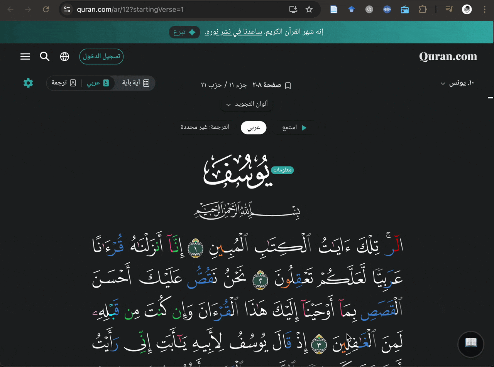
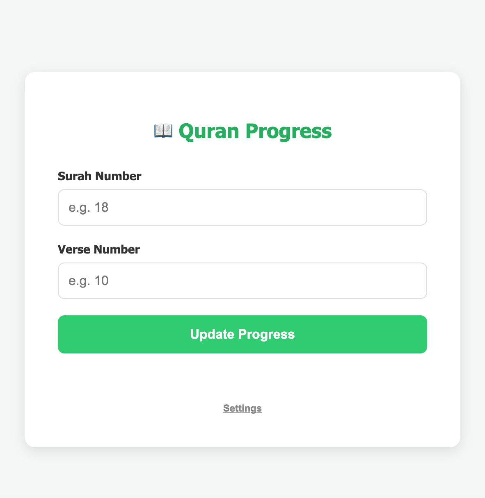

# Quran Progress Updater

A tool to track your Quran reading progress by integrating [Quran.com](https://quran.com) with [Todoist](https://todoist.com). It is available as a Chrome extension and a standalone web version.

## Features

- **Sync Progress:** Updates a Todoist task with the current Ayah and a direct link to Quran.com.
- **Rich Metadata:** Fetches Surah name, page, and Juz via the Al Quran Cloud API.
- **Language Support:** Choose between Arabic and English for metadata and links.
- **Auto-Complete:** Marks the tracking task as complete if it's due today or overdue.
- **Privacy:** All credentials (API tokens) are stored locally in your browser.

## Screenshots
### Extension version

### Standalone HTML version

<!--  -->

## Preparation

1.  **Create a recurring task in Todoist:** This is where the data will be stored. 
1.  **Get Task ID:** Create a dedicated task in Todoist (e.g., "Daily Quran Reading").
2.  Open the task in your browser and copy the **Task ID** from the end of the URL (the long string of numbers after `/task/`).
3.  **Get API Token:** Find your Todoist API Token in **Settings > Integrations > Developer**.

## Chrome Extension

### Installation

1. Clone or download this repository.
2. Open Chrome and navigate to `chrome://extensions`.
3. Enable **Developer mode** (top-right toggle).
4. Click **Load unpacked** and select the root directory of this project.

### Configuration

1. In `chrome://extensions`, find **Quran Progress Updater** and click **Details**.
2. Click **Extension options**.
3. Enter your **Todoist API Token** and the **Task ID**.
4. Click **Save**.

### Usage

1. Visit [Quran.com](https://quran.com).
2. Click the **"Activate Ayah Selector"** button at the bottom right.
3. Click on the Ayah you just finished reading.
4. The extension will handle the rest!

## Web Version (GitHub Pages)

The `/docs` directory contains a standalone version suitable for mobile or browsers without extension support.

1.  **Setup:** Enable GitHub Pages for your fork/repository pointing to the `/docs` directory (or open `docs/index.html` locally).
2.  **Configuration:** On first visit, enter your **Todoist API Token** and **Task ID** in the settings.
3.  **Usage:** Enter the **Surah Number** and **Ayah Number** manually and click **Update Progress**.

## Security & Privacy

This project is 100% client-side. Your API token is only sent to the official Todoist and Al Quran Cloud APIs and is never stored on any external server.
